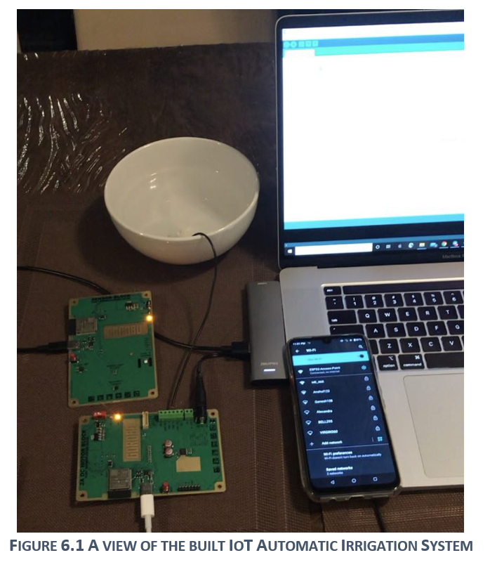
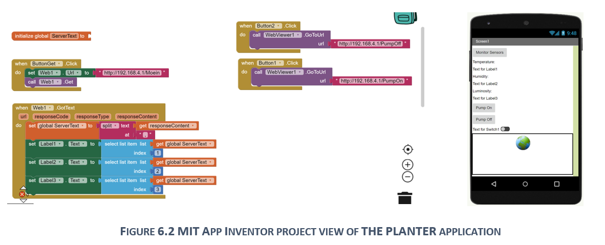

# IoT-Powered-Automated-Irrigation-System
The idea is to create a Smart Gardener System to control the soil moisture, light, temperature, air circulation, soil nutrients, and growing stage of the plant. In phase 1 of this project, temperature and humidity sensors are installed on the client Arduino board and their recordings will be communicated to server board where pump is connected. Server will receive the sensors' data from client board and controls the pump to satisfy a predefined condition. Server also communicates with a mobile application through local WiFi.

## 1	Introduction
The mood and spirit of human being is unified with nature. It is always a pleasant and relaxing feeling to spend time in the nature but finding time in the busy schedule in this hectic world is not easy. Especially, these days, with the rise in apartment residencies, outdoor weather condition, and recently Covid-19 pandemic, the connection between human and nature is needed more than ever. Having an indoor garden can really help to create a soothing indoor atmosphere for the residents, independent of outdoor weather condition and time constraints. But, not only one is a professional gardener and or have time to take care of the plants. So, in this project, a smart gardening system is going tobe designed which is able to take care of indoor plants automatically and keeps the environmental condition ideal for growing a healthy plant with minimum need for human interaction.
 
## 2	How smart gardener works
Smart gadener makes sure that the following factors stay within a specified range to guarantee a healthy plant. Following factors needed to be considered into design of this system.
-	Soil moisture
-	Light
-	Temperature
-	air circulation
-	Soil nutrients
-	Growing stage of the plant
These factors needed to be monitored by sensors and artificial intelligence techniques and then required actions needed to be taken through actuators to establish an ideal condition for growing the plants. This project can be accomplished in three phases:

Phase 1: Basic Level
Phase 2: IoT Level
Phase 3: Smart Level

In phase 1, all the sensors and actuators needed to control the soil humidity, light, Temperature, and air blow are integrated to create a basic smart system that can satisfy the light, temperature and soil humidity reqirements of the plant.
In phase 2, smart gardener is able to communicate with mobile applications over the local network and report the vital data and issue warnings and suggestions to the customer.
In phase 3, using image processing techniques different stages of a growing plant will be monitored, and adjust the parameters based on its stage of life. A database of all indoor plants and vegetations with their grow requirements will be added to the application, so user can select the growing plant and all parameters will be set automatically.

## 3	Phase 1: Basic Level
A variety of items are needed for each phase. Following items are the main parts required for phase 1 (EDUcentrum, 2020). 

In phase 1, the analogue output of Soil Moisture Sensor will be converted into a digital output through soil moisture sensor module. MaCIoT board receives data from onboard temperature, humidity, and ambient light sensors and process them along with data received from soil moisture sensor module and decides to turn on-off the water pump and LED array to control the soil moisture and ambient light, respectively. All sensor readings will be displayed on the screen.

## 4	Phase 2: IoT Level

In this phase we still be using the same items as phase 1, but we add the capability of transmitting data through wifi to an electronic device such as mobile phone or computer. An application will be designed to communicate with MaCIoT board using HTTP protocol. The pplication will be able to program the operation of MaCIoT board so it can adjust the parameters on the specific plant that user selects through the application. The application will also be able to monitor the live sensor data in its GUI.

## 5	Phase 3: Smart Level
In this phase, a camera will be added to the system which is able to monitor the growth of Angiosperm type of plants. The camera through image processing finds out about the inititiation of the blossom and beside notifing the user, it adjusts the parameters accordingly. The application can also be equipped with camera monitoring component and google voice command technology, so the user can monitor the plant through mobile phone and readily dictate the commands to the program.

## 6	IoT Automated Irrigation System
In this project, an automated irrigation system is built to water indoor plants based on the info from the senors. The available boards from the course were used to accomplish this project that caused some difficulties. 
To continue with the project, instead of reading soil moisture, the temperature and humidity data from sensor si7020 were refrenced to control the plant watering. Moreover, water pump ha been connected to motor board. All communication between in this system happen through wifi. User is also able to monitor sensor readings and manually turn on and turn off water pump using a mobile application which was developped via MIT App Inventor. 

In this system, motor board is the client and sensor board is server which constantly monitors temperature, humidity, and environmental luminosity. Based on these info, server keeps the humidity within a predefined range by controling the pump. Server on the other side, receives data from the clients and hare them with corresponding client to take propper action. The input and output data of sensor board as the server are as follows:
-	Inputs: receives data from si7020 sensor, and receives signal from mobile app regarding the manual control of the pump or displaying sensor data on mobile screen.
-	Output: server transmits the sensor measurements to the clients in its network and sends manual control command received from mobile app, exclusively to motor board to manually control the pump.
Motor board is responsible for controlling the pump and receives its command from server. So, basically motor board is always listening to server.
Main component used in this project are: sensor board, motor board, pump, water tank, mobile app as shown in Figure ‎6.1.
 

Mobile app was developped, as Figure ‎6.2, using “MIT App Inventor” and http communication is used to transfer data between boards and app.

We power up motor board and sensor board first then they automatically connect to each other one the local network created by sensor board as the server. By pressing the monitor button on the mobile app, user is able to monitor sensor data on mobile screen. Automatic irrigation control is done by the server but user is also able to manually turn on and off the pump. Every time user presses the pump-on button, a signal is sent to the server to turn on the pump, then server communicates that command with motor board (which is client here) and pump will follow the received comand from the server. 

## References

EDUcentrum. (2020, Feb 18). Automated Gardening Plant with Arduino. Retrieved from project hub: https://create.arduino.cc/projecthub/EDUcentrum/automated-gardening-plant-with-arduino-uno-cf6f09

